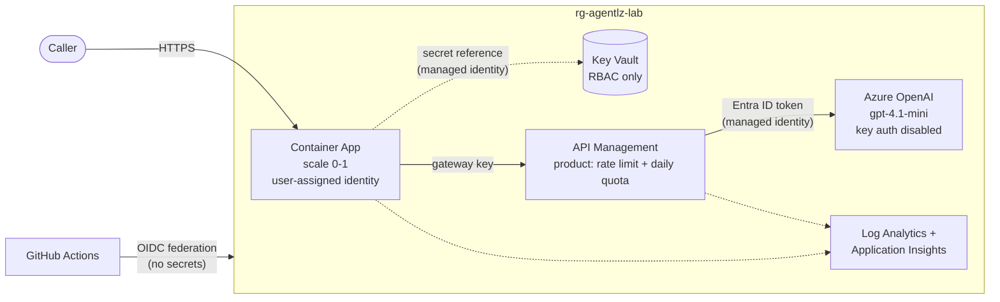

# Azure agent landing zone

A secure, cost-capped Azure foundation for hosting AI agents, built entirely in Terraform and deployed by GitHub Actions with no stored cloud credentials.

It's the platform the rest of my agent labs deploy onto: an app running on Container Apps calls a model on Azure OpenAI through API Management, with every hop authenticated by managed identity, every secret in Key Vault, and spend bounded by design rather than by hope.



## What this demonstrates

| Area | How it's done here |
|---|---|
| **Zero-secret identity chain** | Azure OpenAI has key authentication disabled. The only identity that can call it is API Management's managed identity. The app's gateway key reaches the container as a Key Vault *reference* resolved at runtime; the value never appears in app configuration. |
| **Least-privilege CI/CD** | GitHub Actions authenticates with OIDC federation, trusted only for this repository's `lab` environment and its pull requests. The pipeline identity is Contributor on one resource group, and can grant exactly three named roles there, enforced by an Azure ABAC condition. |
| **Cost engineering** | Scale-to-zero compute, pay-per-token model, a gateway call quota, a per-request token ceiling, a daily log ingestion cap, a subscription budget, and a nightly teardown. See [Cost](#cost). |
| **Infrastructure as code** | Five reusable modules on azurerm 5.x, remote state in a storage account with shared keys disabled, and soft-deleted resources purged on destroy so teardown is complete. |
| **Policy as code** | `terraform fmt`, `validate`, TFLint, and Checkov on every push. Every Checkov exception is justified inline, next to the resource it applies to. |
| **Gateway governance** | API Management products, subscriptions, rate limits, and quotas. The token-aware `llm-token-limit` policy renders automatically on tiers that support it. |

## Repository layout

```
bootstrap/          One-time setup, run locally as subscription Owner
infra/              The landing zone, deployed by GitHub Actions
modules/
  observability/    Log Analytics (daily cap) + workspace-based Application Insights
  keyvault/         RBAC-only Key Vault
  openai/           Azure OpenAI account and model deployment, key auth disabled
  apim/             Gateway, managed-identity backend, product, policies
  container-app/    Consumption environment and scale-to-zero app
app/                Sample agent API (FastAPI) with tests
.github/workflows/  CI, Deploy (manual), Destroy (manual + nightly)
```

## Cost

Prices are pay-as-you-go retail rates for East US 2 from the Azure Retail Prices API, September 2026.

| Resource | Rate | Lab cost |
|---|---|---|
| Container Apps (Consumption) | $0.000024 per vCPU-second active; $0.40 per million requests | Scales to zero; a lab session fits in the monthly free grant |
| Azure OpenAI gpt-4.1-mini (Global Standard) | $0.40 per 1M input tokens, $1.60 per 1M output tokens | Fractions of a cent per request |
| API Management Consumption | First 1M calls free, then $0.035 per 10K | $0 |
| API Management Developer (optional) | $0.0658 per hour | ~$1.58 per day; only when chosen for a token-limit demo |
| Log Analytics | First 5 GB per month free, then $2.76 per GB | $0; ingestion is capped at 0.1 GB per day |
| Key Vault (Standard) | $0.03 per 10K operations | Effectively $0 |
| Terraform state (Storage, LRS) | Per GB stored | Under $0.10 per month |

**Worst case, by construction.** The gateway allows 200 calls per day. Input is capped at 2,000 characters and output at 300 tokens per call, so a full day of abuse costs at most about 200 × (≈550 input + 300 output tokens) ≈ **$0.14**. The nightly teardown means nothing runs longer than a day, and a subscription budget alerts at $5, $8, and $10.

## How to run it

**Prerequisites:** Terraform 1.9+, Azure CLI, an Azure subscription where you're Owner, and a fork of this repository.

1. **Bootstrap** (once). Creates remote state, the lab resource group, the GitHub OIDC identity and its scoped permissions, and the budget.
   ```bash
   az login
   cd bootstrap
   terraform init
   terraform apply -var='budget_contact_emails=["you@example.com"]' \
                   -var='github_repository=<owner>/<repo>'
   ```
   GitHub identifies repositories to Azure by immutable numeric IDs (for example `repo:owner@123/name@456:environment:lab`), so a deleted and recreated repository with the same name can't inherit this trust. Create the repository before running bootstrap so the IDs exist.
   ```
2. **Configure GitHub.** Create an environment named `lab`, then add these repository variables from the bootstrap outputs. None of them are secrets.

   | Variable | Bootstrap output |
   |---|---|
   | `AZURE_CLIENT_ID` | `azure_client_id` |
   | `AZURE_TENANT_ID` | `azure_tenant_id` |
   | `AZURE_SUBSCRIPTION_ID` | `azure_subscription_id` |
   | `TFSTATE_RESOURCE_GROUP` | `tfstate_resource_group` |
   | `TFSTATE_STORAGE_ACCOUNT` | `tfstate_storage_account` |
   | `TFSTATE_CONTAINER` | `tfstate_container` |
   | `LAB_RESOURCE_GROUP` | `lab_resource_group` |
   | `PUBLISHER_EMAIL` | Your email, for API Management |

3. **Deploy.** Run the **Deploy** workflow. It builds the image, applies Terraform, and runs an end-to-end smoke test through the whole identity chain.
4. **Tear down.** Run **Destroy**, or let the nightly schedule do it.

> The first deploy publishes the container image to GitHub Packages as private. Make the package public once (package settings → Change visibility) so Container Apps can pull it without registry credentials.

## Design decisions

- **API Management Consumption by default.** It costs nothing at lab volume, but it can't run `llm-token-limit`, so the default build caps spend with a call quota plus a per-request token ceiling instead. Choosing `Developer_1` in the Deploy workflow switches on token-aware limits with no code change.
- **Public endpoints, strong identity.** Private endpoints cost about $7 a month each, and the Consumption tiers can't join a virtual network. Here the controls are identity instead: key auth is off on Azure OpenAI, Key Vault is RBAC-only, and state storage accepts Entra ID only. Private networking is the production step, and every module exposes a `public_network_access_enabled` switch for it.
- **Fresh names on each deploy.** Soft-deleted Key Vaults and Azure OpenAI accounts reserve their names, so a random suffix avoids collisions. A narrowly scoped custom role lets the pipeline purge them on destroy.
- **Budget in bootstrap, not infra.** Anything the nightly teardown destroys can't also be the thing watching spend.
- **Token metrics come later.** Emitting per-subscription token metrics from API Management needs a diagnostic setting azurerm 5.6 doesn't expose. It arrives in the AIOps lab, where the dashboards live.

## Part of a series

This lab is the foundation for the others at [ziyaduqdah.com](https://ziyaduqdah.com/#labs).
